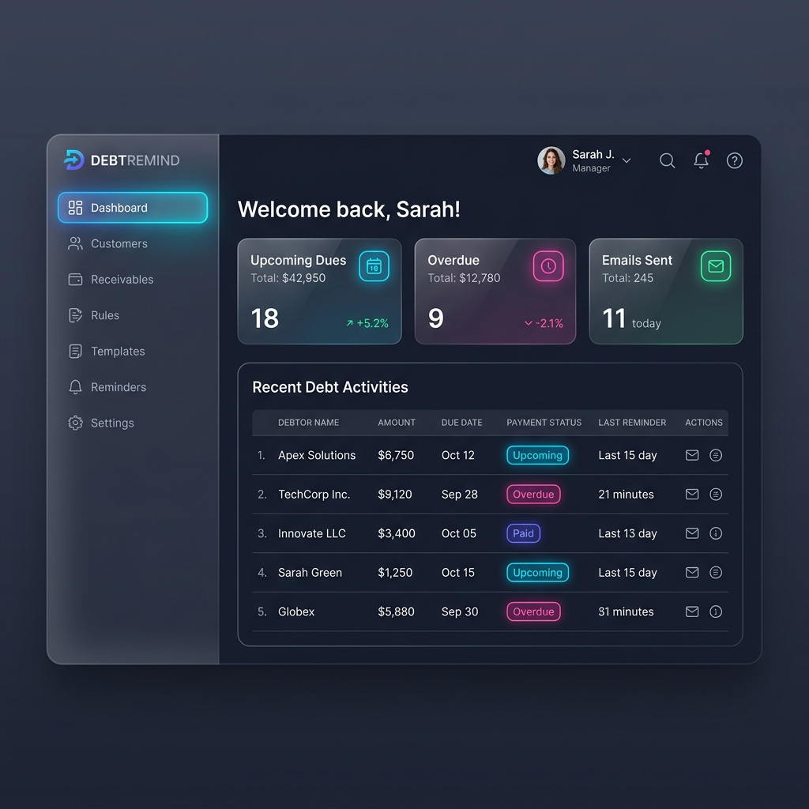

# 📘 Debt Reminder System

*🌍 [Tiếng Việt](README.vi.md)*

  

<p align="center">
  
</p>

Welcome to the **Debt Reminder System** – A professional, automated debt management and reminder system designed with a **Zero-Ops (Serverless)** architecture and running **100% Free** on Cloudflare's infrastructure.

This system is built to free you from manually tracking due dates and sending collection messages. Everything from sending reminder emails to tracking debts is fully automated.

---

## 🌟 Key Features
1. **Customer Management**: Store customer information, phone numbers, and emails.
2. **Receivables Management**: Create accounts receivable, assign them to customers, and set due dates and amounts.
3. **Email Templates**: Pre-write reminder email templates (friendly, urgent, warnings, etc.) to be sent automatically.
4. **Automated Rules**: Set up trigger rules (e.g., Automatically send the "Warning Email" 3 days before the due date). The system scans and dispatches emails every 15 minutes.
5. **Dashboard**: View an overview of upcoming debts, overdue payments, and emails sent.

---

## 📚 Comprehensive Documentation

We have provided extremely detailed, step-by-step guides. **Even if you have no programming experience, you can easily set up and use this system!**

👉 **[1. User Guide](./docs/user-guide.md)**
👉 **[2. Local Setup Guide](./docs/setup.md)**
👉 **[3. Deployment Guide (Cloudflare)](./docs/deployment.md)**
👉 **[4. Architecture Overview (For Engineers)](./docs/architecture.md)**

---

## 🚀 Quick Start: 3 Steps

If you just want to spin it up and see how it works locally, follow these 3 steps:

**Step 1: Clone the repository**
Open your Terminal (Mac) or Command Prompt (Windows) and type:
```bash
git clone <your-repo-url>
cd debt-reminder-system
```

**Step 2: Automated Installation**
(Requires `Node.js` and `pnpm`). Just run the following command to install dependencies, migrate the database, and seed sample data:
```bash
pnpm run setup:local
```

**Step 3: Start the System**
Start the local development servers:
```bash
pnpm dev
```
Then, open your web browser and navigate to: **[http://localhost:5173](http://localhost:5173)**
- **Email**: `admin@example.com`
- **Password**: `admin123`

---

## 🛠 Tech Stack
This system utilizes the modern 2024 tech stack:
- **Cloudflare D1**: Lightning-fast, free edge database.
- **Cloudflare Workers**: The heart of the backend API and automated Cronjobs.
- **Cloudflare Pages**: Hosting for the React / Vite frontend.
- **Resend API**: Professional email delivery service to avoid Spam folders.
- **Monorepo (pnpm)**: Clean and maintainable workspace architecture.

*This project is highly optimized to ensure it never exceeds Cloudflare's Free Tier limits (up to 100,000 DB writes and 5 million reads per day)!*

---

## 📁 Project Structure

```text
debt-reminder-system/
├── apps/
│   ├── api/           # Cloudflare Worker Backend (Hono + D1)
│   └── web/           # React + Vite Frontend (Cloudflare Pages)
├── packages/
│   ├── db/            # Database layer & Drizzle ORM
│   ├── core/          # Business logic, email dispatcher, cron handler
│   └── shared/        # Shared Zod schemas & types
├── docs/              # Comprehensive guides (Setup, Deployment, User Manual)
└── .github/workflows/ # GitHub Actions for Zero-Ops CI/CD
```

---

## 🔐 Environment Variables
In the `apps/api/.dev.vars` file (for local development) or Cloudflare Secrets (for production), you need to configure the following:

| Variable | Description | Example |
|---|---|---|
| `AUTH_SECRET` | Secret key to encrypt authentication tokens. | `my_super_secret_key_123` |
| `RESEND_API_KEY` | API key from Resend.com to send emails. | `re_123456789_xxxxxxxx` |

---

## 🤝 Contributing
Contributions, issues, and feature requests are welcome!
Feel free to check the [issues page](https://github.com/vonguyendang/debt-reminder/issues) if you want to contribute.

1. Fork the Project
2. Create your Feature Branch (`git checkout -b feature/AmazingFeature`)
3. Commit your Changes (`git commit -m 'Add some AmazingFeature'`)
4. Push to the Branch (`git push origin feature/AmazingFeature`)
5. Open a Pull Request

---

## 👤 Author
**Dang Vo**
- Github: [@vonguyendang](https://github.com/vonguyendang)
- Project Link: [https://github.com/vonguyendang/debt-reminder](https://github.com/vonguyendang/debt-reminder)

---

## 📝 License
This project is [MIT](https://opensource.org/licenses/MIT) licensed. 
You are free to use, modify, and distribute it for both commercial and non-commercial purposes.
