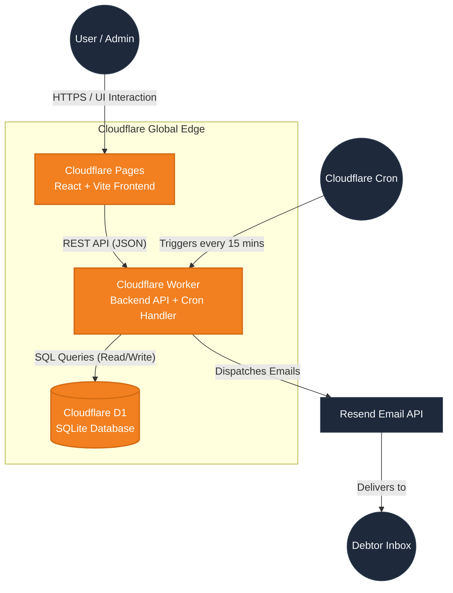

*Language: [English](architecture.md) | [Tiếng Việt](architecture.vi.md)*

**Navigation**: [Home](../README.md) | [Setup Guide](setup.md) | [User Guide](user-guide.md) | [Architecture](architecture.md) | [API Contract](api-contract.md) | [Deployment](deployment.md)

---

# 🏗️ Architecture Overview

*🌍 [Tiếng Việt](architecture.vi.md)*

This document outlines the technical architecture of the Debt Reminder System. The system is designed following a **Serverless Monorepo** pattern, optimizing for high performance, zero maintenance (Zero-Ops), and strict adherence to Cloudflare's Free Tier limits.

---

## 1. High-Level Architecture Diagram

---

## 2. Component Breakdown

### 2.1. Frontend (`apps/web`)
- **Framework**: React 18 + Vite.
- **Routing**: `react-router-dom` for Single Page Application (SPA) navigation.
- **State Management**: React Hooks (`useState`, `useEffect`).
- **Styling**: Pure CSS with CSS Variables for seamless Dark Mode.
- **Deployment**: Hosted on **Cloudflare Pages**. Assets are distributed globally across Cloudflare's CDN.

### 2.2. Backend (`apps/api`)
- **Runtime**: Cloudflare Workers (V8 Isolate engine).
- **Framework**: Custom lightweight Router utilizing the native `URLPattern` API (Zero external dependencies).
- **Triggers**:
  - `fetch`: Handles incoming HTTP REST requests from the frontend.
  - `scheduled`: Handles background cron jobs triggered by Cloudflare.

### 2.3. Database (`packages/db`)
- **Engine**: Cloudflare D1 (Serverless SQLite).
- **ORM / Query Builder**: Built-in raw SQL optimized with prepared statements to minimize CPU usage.
- **Constraints**: Enforced `LIMIT 100` on list queries to prevent exhausting the 5,000,000 reads/day free tier quota.

### 2.4. Core Business Logic (`packages/core`)
- Completely decoupled from HTTP frameworks.
- Contains the `runScheduler` and `runDispatcher` modules responsible for finding due debts, matching them against reminder rules, and securely interacting with the Resend Email API.

---

## 3. Monorepo Strategy (pnpm workspaces)

We utilize `pnpm` workspaces to manage dependencies and link packages locally.

> [!TIP]
> **Why Monorepo?**
> By splitting `shared`, `core`, and `db` into distinct packages, we can easily share Zod validation schemas between the React frontend and the Worker backend, ensuring end-to-end type safety without code duplication.

## 4. Security Model
- **Authentication**: Stateless HMAC-SHA256 JWT tokens generated and verified at the Edge using the Web Crypto API. No database reads are required to verify a logged-in user.
- **CORS**: Strictly configured to only accept requests from the deployed Pages URL.
- **Secrets Management**: Handled entirely via `wrangler secret` and `.dev.vars`, preventing sensitive API keys from entering the repository.
