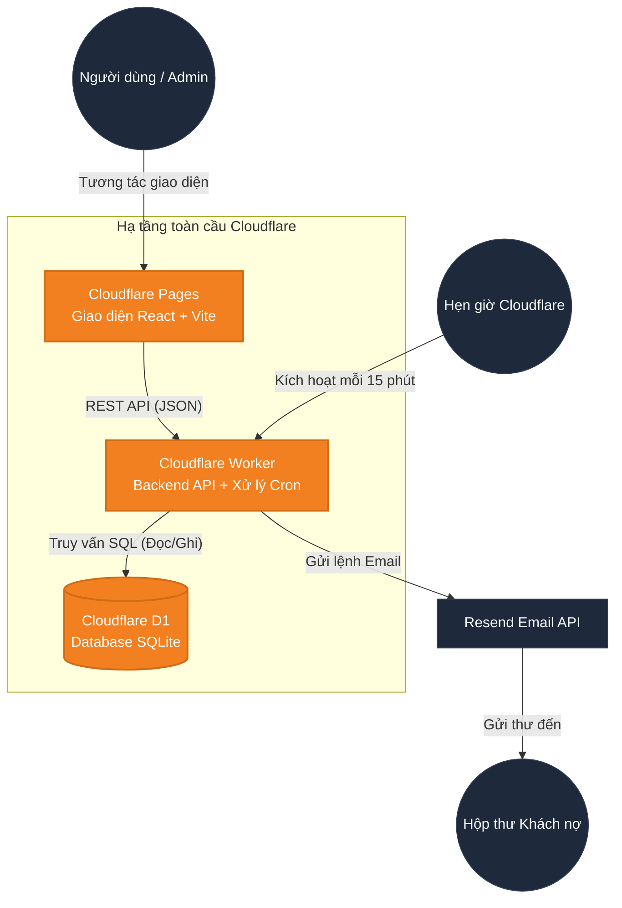

# 🏗️ Kiến Trúc Hệ Thống (Architecture)

*🌍 [English](architecture.md)*

Tài liệu này mô tả chi tiết kiến trúc kỹ thuật của Debt Reminder System. Hệ thống được thiết kế theo mô hình **Serverless Monorepo**, tối ưu hóa cho hiệu năng cao, không cần bảo trì máy chủ (Zero-Ops), và tuân thủ nghiêm ngặt các giới hạn Miễn Phí (Free Tier) của Cloudflare.

---

## 1. Sơ Đồ Kiến Trúc Tổng Quan (High-Level Diagram)

---

## 2. Phân Tích Các Thành Phần

### 2.1. Giao Diện (Frontend - `apps/web`)
- **Framework**: React 18 + Vite.
- **Điều hướng (Routing)**: `react-router-dom` cho ứng dụng một trang (SPA).
- **Quản lý Trạng thái**: React Hooks (`useState`, `useEffect`).
- **Giao diện (Styling)**: CSS thuần kết hợp biến CSS (CSS Variables) để hỗ trợ Dark Mode mượt mà.
- **Triển khai**: Lưu trữ trên **Cloudflare Pages**. Ảnh và giao diện được phân phối siêu tốc qua mạng lưới CDN toàn cầu của Cloudflare.

### 2.2. Não Bộ (Backend - `apps/api`)
- **Môi trường chạy**: Cloudflare Workers (Sử dụng công nghệ V8 Isolate siêu nhẹ).
- **Framework**: Bộ Router tự viết sử dụng hàm `URLPattern` gốc của trình duyệt (Không dùng thư viện ngoài để code chạy nhanh nhất).
- **Nhiệm vụ**:
  - `fetch`: Lắng nghe và xử lý các yêu cầu API từ giao diện web gửi xuống.
  - `scheduled`: Lắng nghe bộ hẹn giờ tự động của Cloudflare để quét nợ và gửi email.

### 2.3. Cơ Sở Dữ Liệu (`packages/db`)
- **Lõi Database**: Cloudflare D1 (SQLite trên nền tảng đám mây Edge).
- **Truy vấn**: Sử dụng SQL thô (Raw SQL) kết hợp Prepared Statements để tối ưu CPU.
- **Bảo vệ hệ thống**: Ép buộc giới hạn `LIMIT 100` trên mọi truy vấn danh sách để tránh cạn kiệt định mức "5 triệu lượt đọc/ngày" của tài khoản Free.

### 2.4. Xử Lý Nghiệp Vụ Chuyên Sâu (`packages/core`)
- Tách biệt hoàn toàn khỏi hệ thống HTTP API.
- Chứa các mô-đun `runScheduler` và `runDispatcher` chuyên chịu trách nhiệm quét các khoản nợ đến hạn, so khớp với Luật nhắc nhở, và an toàn giao tiếp với bên thứ 3 (Resend API) để gửi email.

---

## 3. Chiến Lược Đa Gói (Monorepo)

Chúng ta sử dụng `pnpm workspaces` để quản lý và liên kết các gói mã nguồn.

> [!TIP]
> **Tại sao lại dùng Monorepo?**
> Bằng cách chia dự án thành `shared`, `core`, và `db`, chúng ta có thể dễ dàng tái sử dụng các định dạng kiểm tra dữ liệu (Zod schemas) cho cả Frontend và Backend. Nghĩa là code chỉ viết 1 lần nhưng dùng được ở cả 2 nơi, đảm bảo tính đồng nhất (End-to-end type safety) và cực kỳ dễ bảo trì.

## 4. Mô Hình Bảo Mật (Security)
- **Xác thực (Authentication)**: Sử dụng chuỗi Token (HMAC-SHA256 JWT) sinh ra từ thư viện mã hóa Web Crypto API. Khi bạn gọi API, hệ thống tự động kiểm tra token mà KHÔNG CẦN CHỌC VÀO DATABASE, giúp tiết kiệm cực nhiều tài nguyên.
- **CORS**: Chỉ cho phép giao diện web hợp lệ được gọi API.
- **Quản lý Chìa Khóa Bí Mật**: Quản lý hoàn toàn thông qua file `.dev.vars` và hệ thống bảo mật nội bộ `wrangler secret` của Cloudflare. Mã số thẻ, mã API gửi email sẽ tuyệt đối không bị lọt lên Github.
